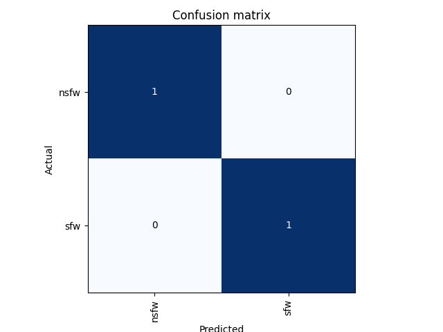
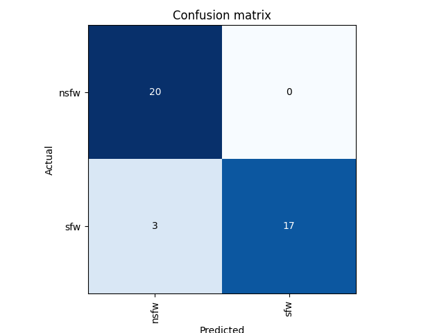
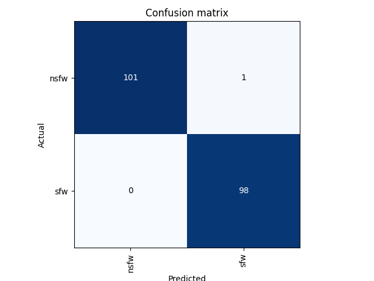
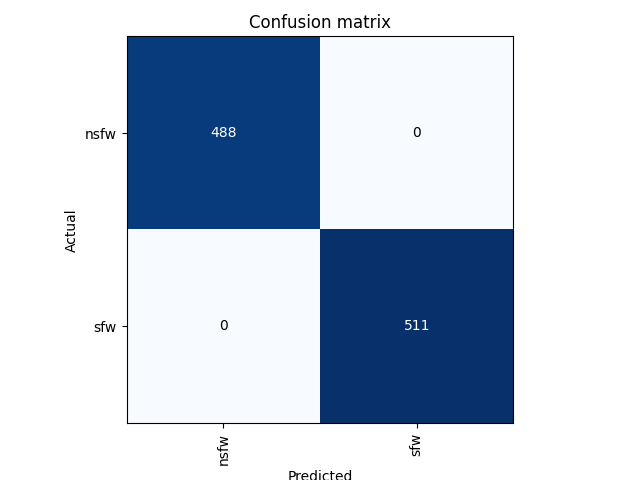

# image
NSFW/SFW Image classification.

## Confusion
All of the datasets were run on 5 epochs and 20% of the data was used for validation. For all of the datasets above the large dataset, 5% of the data was used for validation. 

### Small Dataset
5 images of each class. 10 images total.

### Medium Dataset
100 images of each class. 200 images total.

### Large Dataset
500 images of each class. 1000 images total.

### XL Dataset
10,000 images of each class. 20,000 images total.

